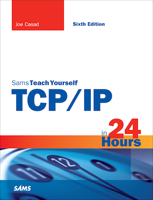

[](https://gitpitch.com/enogrob/ebook-project/master)
```
Roberto Nogueira  
BSd EE, MSd CE
Solution Integrator Experienced - Certified by Ericsson
```
# eBook project



**About**

Learn everything you need to about the subject of this `eBook` project.

[Homepage](http://www.informit.com/store/tcp-ip-in-24-hours-sams-teach-yourself-9780672337895)

## Topics
```
Part I: TCP/IP Basics 1
HOUR 1: What Is TCP/IP? 3
    Networks and Protocols . . . . . . . . . . . . . . . . . . . . . . . . . . . . . . . . . . . . . . . 4
    The Development of TCP/IP . . . . . . . . . . . . . . . . . . . . . . . . . . . . . . . . . . . . 6
    TCP/IP Features . . . . . . . . . . . . . . . . . . . . . . . . . . . . . . . . . . . . . . . . . . . . . 8
    Standards Organizations and RFCs . . . . . . . . . . . . . . . . . . . . . . . . . . . . . . 13
    Summary . . . . . . . . . . . . . . . . . . . . . . . . . . . . . . . . . . . . . . . . . . . . . . . . 15
    Q&A . . . . . . . . . . . . . . . . . . . . . . . . . . . . . . . . . . . . . . . . . . . . . . . . . . . . 15
    Workshop . . . . . . . . . . . . . . . . . . . . . . . . . . . . . . . . . . . . . . . . . . . . . . . . 15
    Key Terms . . . . . . . . . . . . . . . . . . . . . . . . . . . . . . . . . . . . . . . . . . . . . . . . 16
HOUR 2: How TCP/IP Works 19
    The TCP/IP Protocol System. . . . . . . . . . . . . . . . . . . . . . . . . . . . . . . . . . . . 20
    TCP/IP and the OSI Model . . . . . . . . . . . . . . . . . . . . . . . . . . . . . . . . . . . . 22
    Data Packages . . . . . . . . . . . . . . . . . . . . . . . . . . . . . . . . . . . . . . . . . . . . . 24
    A Quick Look at TCP/IP Networking . . . . . . . . . . . . . . . . . . . . . . . . . . . . . 25
    Summary . . . . . . . . . . . . . . . . . . . . . . . . . . . . . . . . . . . . . . . . . . . . . . . . 28
    Q&A . . . . . . . . . . . . . . . . . . . . . . . . . . . . . . . . . . . . . . . . . . . . . . . . . . . . 28
    Workshop . . . . . . . . . . . . . . . . . . . . . . . . . . . . . . . . . . . . . . . . . . . . . . . . 28
    Key Terms . . . . . . . . . . . . . . . . . . . . . . . . . . . . . . . . . . . . . . . . . . . . . . . . 29
Part II: The TCP/IP Protocol System 31
HOUR 3: The Network Access Layer 33
    Protocols and Hardware. . . . . . . . . . . . . . . . . . . . . . . . . . . . . . . . . . . . . . 33
    The Network Access Layer and the OSI Model . . . . . . . . . . . . . . . . . . . . . . 34
    Network Architecture . . . . . . . . . . . . . . . . . . . . . . . . . . . . . . . . . . . . . . . . 35
    Physical Addressing . . . . . . . . . . . . . . . . . . . . . . . . . . . . . . . . . . . . . . . . . 38
    Ethernet . . . . . . . . . . . . . . . . . . . . . . . . . . . . . . . . . . . . . . . . . . . . . . . . . 39
    Anatomy of an Ethernet Frame . . . . . . . . . . . . . . . . . . . . . . . . . . . . . . . . . 40
    Summary . . . . . . . . . . . . . . . . . . . . . . . . . . . . . . . . . . . . . . . . . . . . . . . . 42
    Q&A . . . . . . . . . . . . . . . . . . . . . . . . . . . . . . . . . . . . . . . . . . . . . . . . . . . . 42
    Workshop . . . . . . . . . . . . . . . . . . . . . . . . . . . . . . . . . . . . . . . . . . . . . . . . 42
    Key Terms . . . . . . . . . . . . . . . . . . . . . . . . . . . . . . . . . . . . . . . . . . . . . . . . 43
HOUR 4: The Internet Layer 45
    IP Addresses: A Little Context . . . . . . . . . . . . . . . . . . . . . . . . . . . . . . . . . . 46
    Addressing and Delivering . . . . . . . . . . . . . . . . . . . . . . . . . . . . . . . . . . . . 46
    Internet Protocol . . . . . . . . . . . . . . . . . . . . . . . . . . . . . . . . . . . . . . . . . . . 49
    Address Resolution Protocol . . . . . . . . . . . . . . . . . . . . . . . . . . . . . . . . . . . 61
    Reverse ARP . . . . . . . . . . . . . . . . . . . . . . . . . . . . . . . . . . . . . . . . . . . . . . . 62
    Internet Control Message Protocol . . . . . . . . . . . . . . . . . . . . . . . . . . . . . . . 63
    Summary . . . . . . . . . . . . . . . . . . . . . . . . . . . . . . . . . . . . . . . . . . . . . . . . 64
    Q&A . . . . . . . . . . . . . . . . . . . . . . . . . . . . . . . . . . . . . . . . . . . . . . . . . . . . 64
    Workshop . . . . . . . . . . . . . . . . . . . . . . . . . . . . . . . . . . . . . . . . . . . . . . . . 65
    Key Terms . . . . . . . . . . . . . . . . . . . . . . . . . . . . . . . . . . . . . . . . . . . . . . . . 66
HOUR 5: Subnetting and CIDR 69
    Subnets . . . . . . . . . . . . . . . . . . . . . . . . . . . . . . . . . . . . . . . . . . . . . . . . . . 69
    Dividing the Network . . . . . . . . . . . . . . . . . . . . . . . . . . . . . . . . . . . . . . . . 70
    The Old Way: Subnet Mask . . . . . . . . . . . . . . . . . . . . . . . . . . . . . . . . . . . . 72
    The New Way: CIDR . . . . . . . . . . . . . . . . . . . . . . . . . . . . . . . . . . . . . . . . . 79
    Summary . . . . . . . . . . . . . . . . . . . . . . . . . . . . . . . . . . . . . . . . . . . . . . . . 81
    Q&A . . . . . . . . . . . . . . . . . . . . . . . . . . . . . . . . . . . . . . . . . . . . . . . . . . . . 81
    Workshop . . . . . . . . . . . . . . . . . . . . . . . . . . . . . . . . . . . . . . . . . . . . . . . . 82
    Key Terms . . . . . . . . . . . . . . . . . . . . . . . . . . . . . . . . . . . . . . . . . . . . . . . . 83
HOUR 6: The Transport Layer 85
    Introducing the Transport Layer . . . . . . . . . . . . . . . . . . . . . . . . . . . . . . . . 86
    Transport Layer Concepts . . . . . . . . . . . . . . . . . . . . . . . . . . . . . . . . . . . . . 87
    Understanding TCP and UDP . . . . . . . . . . . . . . . . . . . . . . . . . . . . . . . . . . 92
    Firewalls and Ports . . . . . . . . . . . . . . . . . . . . . . . . . . . . . . . . . . . . . . . . . 102
    Summary . . . . . . . . . . . . . . . . . . . . . . . . . . . . . . . . . . . . . . . . . . . . . . . 103
    Q&A . . . . . . . . . . . . . . . . . . . . . . . . . . . . . . . . . . . . . . . . . . . . . . . . . . . 103
    Workshop . . . . . . . . . . . . . . . . . . . . . . . . . . . . . . . . . . . . . . . . . . . . . . . 104
    Key Terms . . . . . . . . . . . . . . . . . . . . . . . . . . . . . . . . . . . . . . . . . . . . . . . 105
HOUR 7: The Application Layer 109
    What Is the Application Layer? . . . . . . . . . . . . . . . . . . . . . . . . . . . . . . . . 109
    The TCP/IP Application Layer and OSI . . . . . . . . . . . . . . . . . . . . . . . . . . 110
    Network Services . . . . . . . . . . . . . . . . . . . . . . . . . . . . . . . . . . . . . . . . . . 111
    APIs and the Application Layer . . . . . . . . . . . . . . . . . . . . . . . . . . . . . . . . 115
    TCP/IP Utilities . . . . . . . . . . . . . . . . . . . . . . . . . . . . . . . . . . . . . . . . . . . . 115
    Summary . . . . . . . . . . . . . . . . . . . . . . . . . . . . . . . . . . . . . . . . . . . . . . . 116
    Q&A . . . . . . . . . . . . . . . . . . . . . . . . . . . . . . . . . . . . . . . . . . . . . . . . . . . 116
    Workshop . . . . . . . . . . . . . . . . . . . . . . . . . . . . . . . . . . . . . . . . . . . . . . . 117
    Key Terms . . . . . . . . . . . . . . . . . . . . . . . . . . . . . . . . . . . . . . . . . . . . . . . 118
Part III: Networking with TCP/IP 119
HOUR 8: Routing 121
    Routing in TCP/IP . . . . . . . . . . . . . . . . . . . . . . . . . . . . . . . . . . . . . . . . . 121
    Routing on Complex Networks . . . . . . . . . . . . . . . . . . . . . . . . . . . . . . . . 133
    Examining Interior Routers . . . . . . . . . . . . . . . . . . . . . . . . . . . . . . . . . . . 134
    Exterior Routers: BGP. . . . . . . . . . . . . . . . . . . . . . . . . . . . . . . . . . . . . . . 136
    Classless Routing . . . . . . . . . . . . . . . . . . . . . . . . . . . . . . . . . . . . . . . . . . 137
    Higher in the Stack . . . . . . . . . . . . . . . . . . . . . . . . . . . . . . . . . . . . . . . . 138
    Summary . . . . . . . . . . . . . . . . . . . . . . . . . . . . . . . . . . . . . . . . . . . . . . . 139
    Q&A . . . . . . . . . . . . . . . . . . . . . . . . . . . . . . . . . . . . . . . . . . . . . . . . . . . 139
    Workshop . . . . . . . . . . . . . . . . . . . . . . . . . . . . . . . . . . . . . . . . . . . . . . . 140
    Key Terms . . . . . . . . . . . . . . . . . . . . . . . . . . . . . . . . . . . . . . . . . . . . . . . 140
HOUR 9: Getting Connected 143
    Cable Broadband . . . . . . . . . . . . . . . . . . . . . . . . . . . . . . . . . . . . . . . . . . 144
    Digital Subscriber Line . . . . . . . . . . . . . . . . . . . . . . . . . . . . . . . . . . . . . . 145
    Wide Area Networks . . . . . . . . . . . . . . . . . . . . . . . . . . . . . . . . . . . . . . . . 146
    Wireless Networking . . . . . . . . . . . . . . . . . . . . . . . . . . . . . . . . . . . . . . . . 148
    Dial-Up Networking . . . . . . . . . . . . . . . . . . . . . . . . . . . . . . . . . . . . . . . . 157
    Connectivity Devices . . . . . . . . . . . . . . . . . . . . . . . . . . . . . . . . . . . . . . . 161
    Switching Versus Routing . . . . . . . . . . . . . . . . . . . . . . . . . . . . . . . . . . . . 165
    Summary . . . . . . . . . . . . . . . . . . . . . . . . . . . . . . . . . . . . . . . . . . . . . . . 166
    Q&A . . . . . . . . . . . . . . . . . . . . . . . . . . . . . . . . . . . . . . . . . . . . . . . . . . . 167
    Workshop . . . . . . . . . . . . . . . . . . . . . . . . . . . . . . . . . . . . . . . . . . . . . . . 167
    Key Terms . . . . . . . . . . . . . . . . . . . . . . . . . . . . . . . . . . . . . . . . . . . . . . . 168
HOUR 10: Name Resolution 171
    What Is Name Resolution? . . . . . . . . . . . . . . . . . . . . . . . . . . . . . . . . . . . 171
    Name Resolution Using Hosts Files . . . . . . . . . . . . . . . . . . . . . . . . . . . . . 173
    DNS Name Resolution . . . . . . . . . . . . . . . . . . . . . . . . . . . . . . . . . . . . . . 175
    Registering a Domain . . . . . . . . . . . . . . . . . . . . . . . . . . . . . . . . . . . . . . . 181
    Name Server Types . . . . . . . . . . . . . . . . . . . . . . . . . . . . . . . . . . . . . . . . . 182
    Dynamic DNS . . . . . . . . . . . . . . . . . . . . . . . . . . . . . . . . . . . . . . . . . . . . 192
    NetBIOS Name Resolution . . . . . . . . . . . . . . . . . . . . . . . . . . . . . . . . . . . 193
    Summary . . . . . . . . . . . . . . . . . . . . . . . . . . . . . . . . . . . . . . . . . . . . . . . 194
    Q&A . . . . . . . . . . . . . . . . . . . . . . . . . . . . . . . . . . . . . . . . . . . . . . . . . . . 194
    Workshop . . . . . . . . . . . . . . . . . . . . . . . . . . . . . . . . . . . . . . . . . . . . . . . 195
    Key Terms . . . . . . . . . . . . . . . . . . . . . . . . . . . . . . . . . . . . . . . . . . . . . . . 196
HOUR 11: TCP/IP Security 197
    What Is a Firewall? . . . . . . . . . . . . . . . . . . . . . . . . . . . . . . . . . . . . . . . . 197
    Attack Techniques . . . . . . . . . . . . . . . . . . . . . . . . . . . . . . . . . . . . . . . . . 205
    What Do Intruders Want? . . . . . . . . . . . . . . . . . . . . . . . . . . . . . . . . . . . . 206
    Summary . . . . . . . . . . . . . . . . . . . . . . . . . . . . . . . . . . . . . . . . . . . . . . . 219
    Q&A . . . . . . . . . . . . . . . . . . . . . . . . . . . . . . . . . . . . . . . . . . . . . . . . . . . 220
    Workshop . . . . . . . . . . . . . . . . . . . . . . . . . . . . . . . . . . . . . . . . . . . . . . . 220
    Key Terms . . . . . . . . . . . . . . . . . . . . . . . . . . . . . . . . . . . . . . . . . . . . . . . 221
HOUR 12: Configuration 223
    Getting on the Network . . . . . . . . . . . . . . . . . . . . . . . . . . . . . . . . . . . . . 223
    The Case for Server-Supplied IP Addresses . . . . . . . . . . . . . . . . . . . . . . . . 224
    What Is DHCP? . . . . . . . . . . . . . . . . . . . . . . . . . . . . . . . . . . . . . . . . . . . 225
    How DHCP Works . . . . . . . . . . . . . . . . . . . . . . . . . . . . . . . . . . . . . . . . . 226
    DHCP Server Configuration . . . . . . . . . . . . . . . . . . . . . . . . . . . . . . . . . . 229
    Network Address Translation . . . . . . . . . . . . . . . . . . . . . . . . . . . . . . . . . . 230
    Zero Configuration . . . . . . . . . . . . . . . . . . . . . . . . . . . . . . . . . . . . . . . . . 232
    Configuring TCP/IP . . . . . . . . . . . . . . . . . . . . . . . . . . . . . . . . . . . . . . . . 235
    Summary . . . . . . . . . . . . . . . . . . . . . . . . . . . . . . . . . . . . . . . . . . . . . . . 244
    Q&A . . . . . . . . . . . . . . . . . . . . . . . . . . . . . . . . . . . . . . . . . . . . . . . . . . . 244
    Workshop . . . . . . . . . . . . . . . . . . . . . . . . . . . . . . . . . . . . . . . . . . . . . . . 244
    Key Terms . . . . . . . . . . . . . . . . . . . . . . . . . . . . . . . . . . . . . . . . . . . . . . . 246
HOUR 13: IPv6: The Next Generation 247
    Why a New IP? . . . . . . . . . . . . . . . . . . . . . . . . . . . . . . . . . . . . . . . . . . . 248
    IPv6 Header Format . . . . . . . . . . . . . . . . . . . . . . . . . . . . . . . . . . . . . . . . 249
    IPv6 Addressing . . . . . . . . . . . . . . . . . . . . . . . . . . . . . . . . . . . . . . . . . . . 253
    Subnetting . . . . . . . . . . . . . . . . . . . . . . . . . . . . . . . . . . . . . . . . . . . . . . . 254
    Multicasting . . . . . . . . . . . . . . . . . . . . . . . . . . . . . . . . . . . . . . . . . . . . . 255
    Link Local . . . . . . . . . . . . . . . . . . . . . . . . . . . . . . . . . . . . . . . . . . . . . . . 255
    Neighbor Discovery . . . . . . . . . . . . . . . . . . . . . . . . . . . . . . . . . . . . . . . . 256
    Autoconfiguration . . . . . . . . . . . . . . . . . . . . . . . . . . . . . . . . . . . . . . . . . 256
    IPv6 and Quality of Service . . . . . . . . . . . . . . . . . . . . . . . . . . . . . . . . . . . 257
    IPv6 with IPv4 . . . . . . . . . . . . . . . . . . . . . . . . . . . . . . . . . . . . . . . . . . . . 258
    IPv6 Tunnels . . . . . . . . . . . . . . . . . . . . . . . . . . . . . . . . . . . . . . . . . . . . . 258
    Summary . . . . . . . . . . . . . . . . . . . . . . . . . . . . . . . . . . . . . . . . . . . . . . . 261
    Q&A . . . . . . . . . . . . . . . . . . . . . . . . . . . . . . . . . . . . . . . . . . . . . . . . . . . 262
    Workshop . . . . . . . . . . . . . . . . . . . . . . . . . . . . . . . . . . . . . . . . . . . . . . . 262
    Key Terms . . . . . . . . . . . . . . . . . . . . . . . . . . . . . . . . . . . . . . . . . . . . . . . 263
Part IV: Tools and Service 265
HOUR 14: Classic Tools 267
    Connectivity Problems . . . . . . . . . . . . . . . . . . . . . . . . . . . . . . . . . . . . . . 268
    Protocol Dysfunction and Misconfiguration . . . . . . . . . . . . . . . . . . . . . . . 268
    Line Problems . . . . . . . . . . . . . . . . . . . . . . . . . . . . . . . . . . . . . . . . . . . . 274
    Name Resolution Problems . . . . . . . . . . . . . . . . . . . . . . . . . . . . . . . . . . . 274
    Network Performance Problems . . . . . . . . . . . . . . . . . . . . . . . . . . . . . . . . 275
    Telnet . . . . . . . . . . . . . . . . . . . . . . . . . . . . . . . . . . . . . . . . . . . . . . . . . . 280
    Berkeley Remote Utilities . . . . . . . . . . . . . . . . . . . . . . . . . . . . . . . . . . . . . 283
    Secure Shell . . . . . . . . . . . . . . . . . . . . . . . . . . . . . . . . . . . . . . . . . . . . . . 284
    Network Management . . . . . . . . . . . . . . . . . . . . . . . . . . . . . . . . . . . . . . 285
    Summary . . . . . . . . . . . . . . . . . . . . . . . . . . . . . . . . . . . . . . . . . . . . . . . 292
    Q&A . . . . . . . . . . . . . . . . . . . . . . . . . . . . . . . . . . . . . . . . . . . . . . . . . . . 292
    Workshop . . . . . . . . . . . . . . . . . . . . . . . . . . . . . . . . . . . . . . . . . . . . . . . 293
    Key Terms . . . . . . . . . . . . . . . . . . . . . . . . . . . . . . . . . . . . . . . . . . . . . . . 294
HOUR 15: Classic Services 297
    HTTP. . . . . . . . . . . . . . . . . . . . . . . . . . . . . . . . . . . . . . . . . . . . . . . . . . . 298
    Email . . . . . . . . . . . . . . . . . . . . . . . . . . . . . . . . . . . . . . . . . . . . . . . . . . 298
    FTP . . . . . . . . . . . . . . . . . . . . . . . . . . . . . . . . . . . . . . . . . . . . . . . . . . . . 299
    Trivial File Transfer Protocol . . . . . . . . . . . . . . . . . . . . . . . . . . . . . . . . . . 303
    File and Print Services . . . . . . . . . . . . . . . . . . . . . . . . . . . . . . . . . . . . . . . 303
    Lightweight Directory Access Protocol . . . . . . . . . . . . . . . . . . . . . . . . . . . 306
    Remote Control . . . . . . . . . . . . . . . . . . . . . . . . . . . . . . . . . . . . . . . . . . . 309
    Summary . . . . . . . . . . . . . . . . . . . . . . . . . . . . . . . . . . . . . . . . . . . . . . . 311
    Q&A . . . . . . . . . . . . . . . . . . . . . . . . . . . . . . . . . . . . . . . . . . . . . . . . . . . 311
    Workshop . . . . . . . . . . . . . . . . . . . . . . . . . . . . . . . . . . . . . . . . . . . . . . . 311
    Key Terms . . . . . . . . . . . . . . . . . . . . . . . . . . . . . . . . . . . . . . . . . . . . . . . 312
Part V: The Internet 315
HOUR 16: The Internet: A Closer Look 317
    How the Internet Looks . . . . . . . . . . . . . . . . . . . . . . . . . . . . . . . . . . . . . . 317
    What Happens on the Internet . . . . . . . . . . . . . . . . . . . . . . . . . . . . . . . . 320
    URIs and URLs . . . . . . . . . . . . . . . . . . . . . . . . . . . . . . . . . . . . . . . . . . . . 322
    Summary . . . . . . . . . . . . . . . . . . . . . . . . . . . . . . . . . . . . . . . . . . . . . . . 325
    Q&A . . . . . . . . . . . . . . . . . . . . . . . . . . . . . . . . . . . . . . . . . . . . . . . . . . . 325
    Workshop . . . . . . . . . . . . . . . . . . . . . . . . . . . . . . . . . . . . . . . . . . . . . . . 326
    Key Terms . . . . . . . . . . . . . . . . . . . . . . . . . . . . . . . . . . . . . . . . . . . . . . . 326
HOUR 17: HTTP, HTML, and the World Wide Web 329
    What Is the World Wide Web? . . . . . . . . . . . . . . . . . . . . . . . . . . . . . . . . . 329
    Understanding HTML . . . . . . . . . . . . . . . . . . . . . . . . . . . . . . . . . . . . . . . 332
    Cascading Style Sheets . . . . . . . . . . . . . . . . . . . . . . . . . . . . . . . . . . . . . . 337
    Understanding HTTP . . . . . . . . . . . . . . . . . . . . . . . . . . . . . . . . . . . . . . . 338
    Scripting . . . . . . . . . . . . . . . . . . . . . . . . . . . . . . . . . . . . . . . . . . . . . . . . 341
    Web Browsers. . . . . . . . . . . . . . . . . . . . . . . . . . . . . . . . . . . . . . . . . . . . . 344
    The Semantic Web . . . . . . . . . . . . . . . . . . . . . . . . . . . . . . . . . . . . . . . . . 348
    XHTML . . . . . . . . . . . . . . . . . . . . . . . . . . . . . . . . . . . . . . . . . . . . . . . . . 350
    HTML5 . . . . . . . . . . . . . . . . . . . . . . . . . . . . . . . . . . . . . . . . . . . . . . . . . 351
    Summary . . . . . . . . . . . . . . . . . . . . . . . . . . . . . . . . . . . . . . . . . . . . . . . 356
    Q&A . . . . . . . . . . . . . . . . . . . . . . . . . . . . . . . . . . . . . . . . . . . . . . . . . . . 356
    Workshop . . . . . . . . . . . . . . . . . . . . . . . . . . . . . . . . . . . . . . . . . . . . . . . 356
    Key Terms . . . . . . . . . . . . . . . . . . . . . . . . . . . . . . . . . . . . . . . . . . . . . . . 357
HOUR 18: Web Services 359
    Content Management Systems . . . . . . . . . . . . . . . . . . . . . . . . . . . . . . . . 360
    Social Networking . . . . . . . . . . . . . . . . . . . . . . . . . . . . . . . . . . . . . . . . . 361
    Peer-to-Peer . . . . . . . . . . . . . . . . . . . . . . . . . . . . . . . . . . . . . . . . . . . . . . 364
    Understanding Web Services . . . . . . . . . . . . . . . . . . . . . . . . . . . . . . . . . . 365
    XML. . . . . . . . . . . . . . . . . . . . . . . . . . . . . . . . . . . . . . . . . . . . . . . . . . . 368
    SOAP . . . . . . . . . . . . . . . . . . . . . . . . . . . . . . . . . . . . . . . . . . . . . . . . . . 369
    WSDL. . . . . . . . . . . . . . . . . . . . . . . . . . . . . . . . . . . . . . . . . . . . . . . . . . 370
    Web Service Stacks . . . . . . . . . . . . . . . . . . . . . . . . . . . . . . . . . . . . . . . . . 371
    REST . . . . . . . . . . . . . . . . . . . . . . . . . . . . . . . . . . . . . . . . . . . . . . . . . . . 371
    E-Commerce . . . . . . . . . . . . . . . . . . . . . . . . . . . . . . . . . . . . . . . . . . . . . 374
    Summary . . . . . . . . . . . . . . . . . . . . . . . . . . . . . . . . . . . . . . . . . . . . . . . 377
    Q&A . . . . . . . . . . . . . . . . . . . . . . . . . . . . . . . . . . . . . . . . . . . . . . . . . . . 377
    Workshop . . . . . . . . . . . . . . . . . . . . . . . . . . . . . . . . . . . . . . . . . . . . . . . 377
    Key Terms . . . . . . . . . . . . . . . . . . . . . . . . . . . . . . . . . . . . . . . . . . . . . . . 378
HOUR 19: Encryption, Tracking, and Privacy 379
    Encryption and Secrecy . . . . . . . . . . . . . . . . . . . . . . . . . . . . . . . . . . . . . . 380
    Tracking . . . . . . . . . . . . . . . . . . . . . . . . . . . . . . . . . . . . . . . . . . . . . . . . 395
    Anonymity Networks . . . . . . . . . . . . . . . . . . . . . . . . . . . . . . . . . . . . . . . 403
    Summary . . . . . . . . . . . . . . . . . . . . . . . . . . . . . . . . . . . . . . . . . . . . . . . 404
    Q&A . . . . . . . . . . . . . . . . . . . . . . . . . . . . . . . . . . . . . . . . . . . . . . . . . . . 405
    Workshop . . . . . . . . . . . . . . . . . . . . . . . . . . . . . . . . . . . . . . . . . . . . . . . 405
    Key Terms . . . . . . . . . . . . . . . . . . . . . . . . . . . . . . . . . . . . . . . . . . . . . . . 406
Part VI: TCP/IP at Work 409
HOUR 20: Email 411
    What Is Email? . . . . . . . . . . . . . . . . . . . . . . . . . . . . . . . . . . . . . . . . . . . 411
    Email Format . . . . . . . . . . . . . . . . . . . . . . . . . . . . . . . . . . . . . . . . . . . . . 412
    How Email Works . . . . . . . . . . . . . . . . . . . . . . . . . . . . . . . . . . . . . . . . . . 413
    Simple Mail Transfer Protocol . . . . . . . . . . . . . . . . . . . . . . . . . . . . . . . . . 416
    Retrieving the Mail. . . . . . . . . . . . . . . . . . . . . . . . . . . . . . . . . . . . . . . . . 418
    Email Clients . . . . . . . . . . . . . . . . . . . . . . . . . . . . . . . . . . . . . . . . . . . . . 420
    Webmail . . . . . . . . . . . . . . . . . . . . . . . . . . . . . . . . . . . . . . . . . . . . . . . . 422
    Spam . . . . . . . . . . . . . . . . . . . . . . . . . . . . . . . . . . . . . . . . . . . . . . . . . . 423
    Phishing . . . . . . . . . . . . . . . . . . . . . . . . . . . . . . . . . . . . . . . . . . . . . . . . 426
    Summary . . . . . . . . . . . . . . . . . . . . . . . . . . . . . . . . . . . . . . . . . . . . . . . 427
    Q&A . . . . . . . . . . . . . . . . . . . . . . . . . . . . . . . . . . . . . . . . . . . . . . . . . . . 427
    Workshop . . . . . . . . . . . . . . . . . . . . . . . . . . . . . . . . . . . . . . . . . . . . . . . 427
    Key Terms . . . . . . . . . . . . . . . . . . . . . . . . . . . . . . . . . . . . . . . . . . . . . . . 428
HOUR 21: Streaming and Casting 431
    The Streaming Problem . . . . . . . . . . . . . . . . . . . . . . . . . . . . . . . . . . . . . 431
    A Brief Introduction to Multimedia Files . . . . . . . . . . . . . . . . . . . . . . . . . . 432
    Real-Time Transport Protocol–Streaming Over UDP . . . . . . . . . . . . . . . . . 435
    RTMP–Streaming Over TCP . . . . . . . . . . . . . . . . . . . . . . . . . . . . . . . . . . 438
    SCTP and DCCP–Replacing the Transport Layer . . . . . . . . . . . . . . . . . . . 439
    Streaming Over HTTP . . . . . . . . . . . . . . . . . . . . . . . . . . . . . . . . . . . . . . . 440
    HTML5 and Multimedia . . . . . . . . . . . . . . . . . . . . . . . . . . . . . . . . . . . . . 442
    Podcasting . . . . . . . . . . . . . . . . . . . . . . . . . . . . . . . . . . . . . . . . . . . . . . . 442
    Voice over IP . . . . . . . . . . . . . . . . . . . . . . . . . . . . . . . . . . . . . . . . . . . . . 443
    Summary . . . . . . . . . . . . . . . . . . . . . . . . . . . . . . . . . . . . . . . . . . . . . . . 445
    Q&A . . . . . . . . . . . . . . . . . . . . . . . . . . . . . . . . . . . . . . . . . . . . . . . . . . . 445
    Workshop . . . . . . . . . . . . . . . . . . . . . . . . . . . . . . . . . . . . . . . . . . . . . . . 446
    Key Terms . . . . . . . . . . . . . . . . . . . . . . . . . . . . . . . . . . . . . . . . . . . . . . . 446
HOUR 22: Living in the Cloud 449
    What Is the Cloud? . . . . . . . . . . . . . . . . . . . . . . . . . . . . . . . . . . . . . . . . 449
    Private Clouds . . . . . . . . . . . . . . . . . . . . . . . . . . . . . . . . . . . . . . . . . . . . 460
    Future of Computing . . . . . . . . . . . . . . . . . . . . . . . . . . . . . . . . . . . . . . . 461
    Summary . . . . . . . . . . . . . . . . . . . . . . . . . . . . . . . . . . . . . . . . . . . . . . . 462
    Q&A . . . . . . . . . . . . . . . . . . . . . . . . . . . . . . . . . . . . . . . . . . . . . . . . . . . 462
    Workshop . . . . . . . . . . . . . . . . . . . . . . . . . . . . . . . . . . . . . . . . . . . . . . . 462
    Key Terms . . . . . . . . . . . . . . . . . . . . . . . . . . . . . . . . . . . . . . . . . . . . . . . 463
HOUR 23: Internet of Things 465
    What Is the Internet of Things? . . . . . . . . . . . . . . . . . . . . . . . . . . . . . . . . 465
    IoT Platforms . . . . . . . . . . . . . . . . . . . . . . . . . . . . . . . . . . . . . . . . . . . . . 467
    Up Close: MQTT . . . . . . . . . . . . . . . . . . . . . . . . . . . . . . . . . . . . . . . . . . . 470
    RFID . . . . . . . . . . . . . . . . . . . . . . . . . . . . . . . . . . . . . . . . . . . . . . . . . . . 472
    Summary . . . . . . . . . . . . . . . . . . . . . . . . . . . . . . . . . . . . . . . . . . . . . . . 474
    Q&A . . . . . . . . . . . . . . . . . . . . . . . . . . . . . . . . . . . . . . . . . . . . . . . . . . . 474
    Workshop . . . . . . . . . . . . . . . . . . . . . . . . . . . . . . . . . . . . . . . . . . . . . . . 474
    Key Terms . . . . . . . . . . . . . . . . . . . . . . . . . . . . . . . . . . . . . . . . . . . . . . . 475
HOUR 24: Implementing a TCP/IP Network: 7 Days in the Life of a Sys Admin 477
    A Brief History of Hypothetical, Inc.. . . . . . . . . . . . . . . . . . . . . . . . . . . . . 477
    7 Days in the Life of Maurice . . . . . . . . . . . . . . . . . . . . . . . . . . . . . . . . . 478
    Summary . . . . . . . . . . . . . . . . . . . . . . . . . . . . . . . . . . . . . . . . . . . . . . . 487
    Q&A . . . . . . . . . . . . . . . . . . . . . . . . . . . . . . . . . . . . . . . . . . . . . . . . . . . 487
    Workshop . . . . . . . . . . . . . . . . . . . . . . . . . . . . . . . . . . . . . . . . . . . . . . . 488
    Key Terms . . . . . . . . . . . . . . . . . . . . . . . . . . . . . . . . . . . . . . . . . . . . . . . 488
APPENDIXES
APPENDIX A: Answers to Quizzes and Exercises 491
APPENDIX B: Sources 503
9780672337895, TOC, 2/1/2017
```
